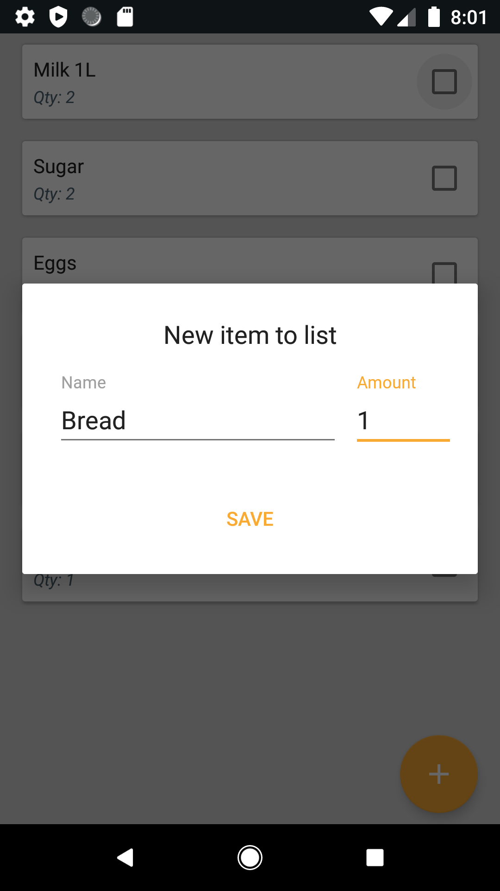

# GroceryAppp 📱

This is a simple app created to manage our shopping list.
This project is only for learning purpose so feel free to download or fork the project.

# Screenshots
 

# Libraries this app uses 📌

1. Android Architecture Components - https://developer.android.com/topic/libraries/architecture/adding-components
2. Koin DI - https://github.com/InsertKoinIO/koin

